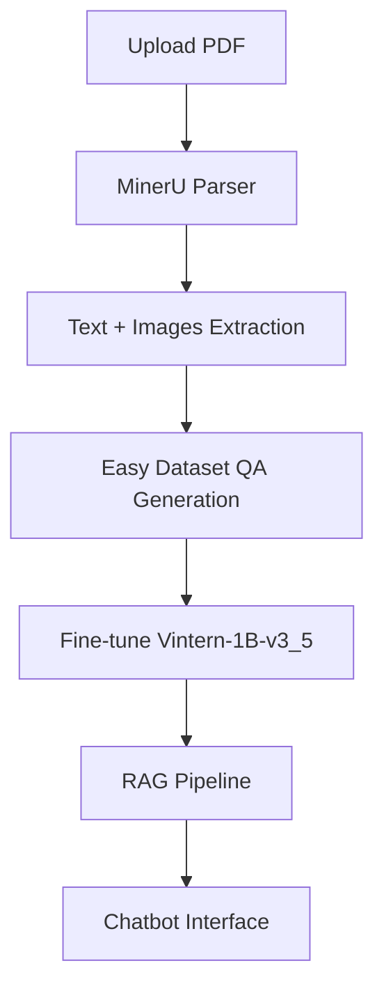

# Mô hình hệ thống hỏi - đáp đa phương thức về các tài liệu khoa học trong lĩnh vực Công nghệ Thông tin

**Mã số đề tài:** SVC2025-147  
**Chương trình:** Nghiên cứu Khoa học Sinh viên cấp Trường - Đại học Sài Gòn  
**Nhóm thực hiện:** Châu Gia Anh (Chủ nhiệm), Dương Lê Khánh  
**Giảng viên hướng dẫn:** PGS. TS. Nguyễn Tuấn Đăng  

---

## 📋 Giới thiệu

Đề tài xây dựng một **hệ thống hỏi - đáp đa phương thức (Multimodal Document QA)** bằng tiếng Việt, có khả năng hiểu và trả lời câu hỏi dựa trên **văn bản + hình ảnh + bảng biểu + biểu đồ** trong các tài liệu khoa học lĩnh vực Công nghệ Thông tin.

Hệ thống kết hợp:
- Xử lý tài liệu khoa học bằng **MinerU**
- Tạo dataset QA chất lượng cao bằng **Easy Dataset**
- Fine-tune mô hình **Vintern-1B-v3_5**
- Xây dựng hệ thống RAG (Retrieval-Augmented Generation) để trả lời chính xác và có trích dẫn nguồn

---

## ✨ Tính năng chính

- Hỏi đáp bằng **tiếng Việt** trên tài liệu khoa học CNTT
- Hỗ trợ **đa phương thức**: hiểu được bảng biểu, biểu đồ, sơ đồ kiến trúc, công thức toán học
- Tự động trích dẫn nguồn (source citation)
- Giao diện chatbot thân thiện (triển khai bằng n8n / Langflow)
- Khả năng mở rộng cho nhiều loại tài liệu (luận văn, báo cáo NCKH, paper…)

---

## 🏗️ Kiến trúc hệ thống

---

## 📊 Kết quả nghiên cứu

- Đã xây dựng bộ dữ liệu VnIT-MDQA từ các luận văn và paper CNTT
- Fine-tune thành công mô hình Vintern-1B-v3_5
- Cải thiện đáng kể các metrics so với mô hình gốc
- Hệ thống RAG hoạt động ổn định với khả năng trả lời đa phương thức

(Chi tiết kết quả sẽ được cập nhật sau khi hoàn thành đánh giá cuối cùng)

## 📁 Cấu trúc Repository

dataset/ — Bộ dữ liệu train/eval (JSONL)
mineru_output/ — Kết quả parse PDF bằng MinerU
notebooks/ — Các notebook Colab fine-tune và đánh giá
workflows/ — Workflow n8n / Langflow cho RAG chatbot
results/ — Bảng biểu, biểu đồ so sánh, ví dụ QA
docs/ — Báo cáo tổng kết và thuyết minh đề tài

## 🚀 Hướng dẫn sử dụng

- Clone repository
- Cài đặt môi trường (xem requirements.txt)
- Chạy inference chatbot qua n8n/Langflow
- Sử dụng notebook để fine-tune thêm nếu cần

## 👥 Tác giả

- Chủ nhiệm đề tài: Châu Gia Anh (MSSV: 3122411002)
- Thành viên: Dương Lê Khánh (MSSV: 3122411093)
- Giảng viên hướng dẫn: PGS. TS. Nguyễn Tuấn Đăng